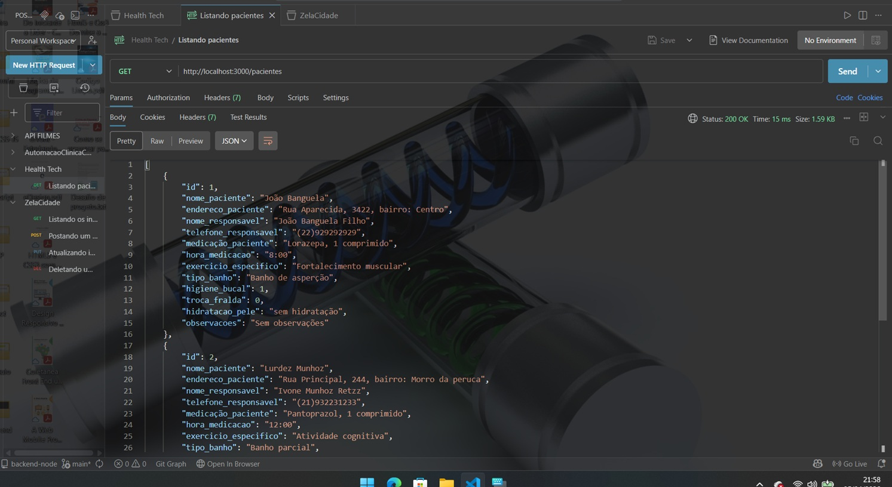
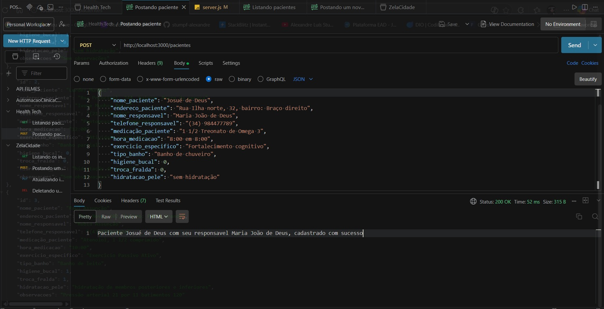
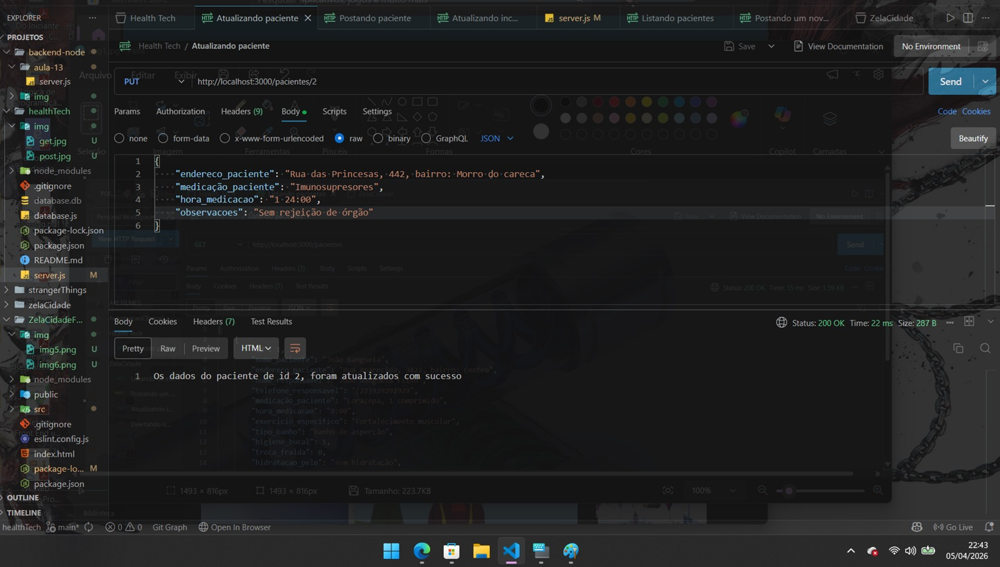
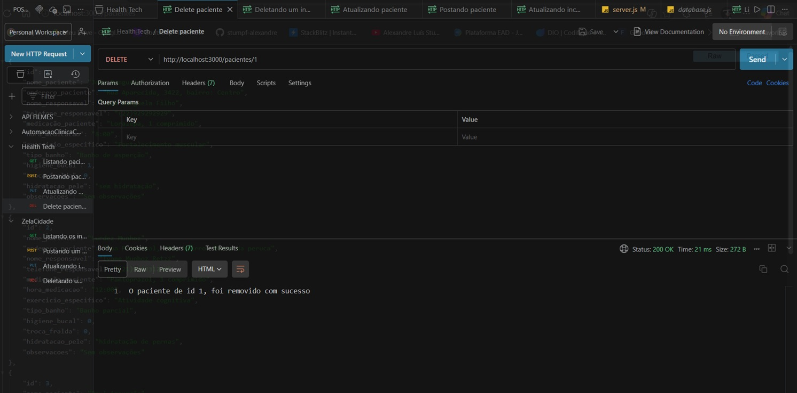

# 🩺 Health Tech (Sistema de Gestão de Rotinas para Cuidadores Autônomos)

## 📌 Sobre o Projeto
A API **Health Tech** é desenvolvida para facilitar o dia a dia de cuidadores de idosos que gerenciam múltiplos pacientes simultaneamente. A aplicação centraliza informações vitais, garantindo que cada idoso receba o atendimento personalizado que sua condição exige, como:
- Histórico médico
- Contatos de emergência
- Lista de medicamentos.

Essa API nos permite criar, visualizar, atualizar e deletar tanto os dados dos pacientes, como suas rotinas diárias.

---

## 🛠️ Tecnologias Utilizadas
- Node.js
- Express
- SQLite
- SQLite3
- Nodemon
- Postman

---

## 📦 Instalação
- `npm init -y` => Comando para iniciar um novo projeto Java Script.
- `npm install express` => Comando para instalar o Express.
- `npm install nodemon --save-dev` => Comando para instalar o nodemon.
- `npm install sqlite3 sqlite` => Comando para instalar o SQLite e o SQLite3.

---

## ▶️ Como Executar

```bash
npm run dev

```

`http://localhost:3000`

[Clique Aqui](http:localhost:3000)

---

## 🗄️ Banco de Dados
O Banco de Dados é criado automaticamente ao iniciar o projeto.

```
database.db
```

---

## 🧾 Tabela

|Campo                    |Descrição                                               |
|-------------------------|--------------------------------------------------------|
|id                       |Identificador único                                     |
|nome_paciente            |Nome do Paciente                                        |
|endereco_paciente        |Onde o paciente vive                                    |
|nome_responsavel         |Nome da pessoa responsavel pelo paciente                |
|telefone_responsavel     |Telefone para contato com responsavel do paciente       |
|medicacao                |Nome da medicação diária do paciente                    |
|hora_medicacao           |Horario da administração do medicamento ao paciente     |
|exercicio_especifico     |Qual o tipo de exercicio que o paciente vai receber     |
|tipo_banho               |Qual o tipo de banho que o paciente necessita           |
|higiene_bucal            |Identifica se o paciente necessita de higiene bucal     |
|troca_fralda             |Identifica se o paciente necessita de troca de fralda   |
|hidratacao_pele          |Necessidade de hidratação na pele do paciente           |
|observacao               |Observações (Padrão: Sem observações)                   |

---

## 🔗 Endpoints

### Rota Inicial

```http
GET /
```
Retorna uma página HTML simples com informações da API.


### Rota para listar todos os pacientes

```http
GET /pacientes
```
Retorna todos os registros do banco de dados


### Rota para buscar um paciente específico (ID)

```http
GET /pacientes/:id
```
Ex.: /pacientes/3

Retorna os dados de um paciente especifico.

#### - Body (JSON)

```json
{
    "id": 3,
    "nome_paciente": "Raul Assunção",
    "endereco_paciente": "Rua Nova, 102, bairro: Praia Grande",
    "nome_responsavel": "Rubia Assunção",
    "telefone_responsavel": "(43)898922224",
    "medicação_paciente": "Atenolol, 1 1/2 comprimido",
    "hora_medicacao": "10:00",
    "exercicio_especifico": "Exercicio Passivo Ativo",
    "tipo_banho": "Banho de leito",
    "higiene_bucal": 1,
    "troca_fralda": 1,
    "hidratacao_pele": "hidratação de membros posteriores e inferiores",
    "observacoes": "Pressão arterial 21 por 11 batimentos 120"
},
```


### Rota para criar um novo paciente

```http
POST /pacientes
```

#### - Body (JSON)

```json
{
    "id": 5,
    "nome_paciente": "Josué de Deus",
    "endereco_paciente": "Rua Ilha norte, 32, bairro: Braço direito",
    "nome_responsavel": "Maria João de Deus",
    "telefone_responsavel": "(34) 984477789",
    "medicação_paciente": "1 1/2 Treonato de Omega 3",
    "hora_medicacao": "8:00 em 8:00",
    "exercicio_especifico": "Fortalecimento cognitivo",
    "tipo_banho": "Banho de chuveiro",
    "higiene_bucal": 0,
    "troca_fralda": 0,
    "hidratacao_pele": "sem hidratação",
    "observacoes": "Sem observações"
},
```


### Rota para atualizar um paciente

```http
PUT /paciente/:id
```

#### - Body (JSON)

```json
{
    "endereco_paciente": "Rua das Princesas, 442, bairro: Morro do careca",
    "medicação_paciente": "Imunosupresores",
    "hora_medicacao": "1 24:00",
    "observacoes": "Sem rejeição de órgão"
}
```

### Rota para deletar um paciente

```http
DELETE /pacientes/:id
```
---

## 🔐 Segurança

A API utiliza `?` nas queries SQL:

```sql
WHERE id = ?
```

Isso evita o SQL Injection

---

## 📚 Conceitos

- CRUD (Create, Read, Update e Delete)
- Rotas com Express
- Métodos/Verbos HTTP

---

## 👩‍💻 Projeto Educacional

Este projeto foi desenvolvido para fins de aprendizado em back-end com Node.js, por Alexandre

---

## ⚙️ Demonstrando o funcionamento da solução

* ### Função GET para listar API dos pacientes


---

* ### Função POST para postar novo paciente na API


---

* ### Função PUT para atualizar dados de um paciente


---

* ### Função DELETE para deletar um paciente da API
* 